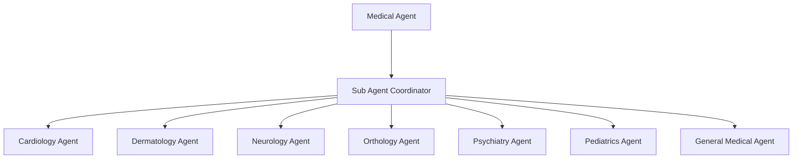

# Medical Agent

## Overview

The Medical Agent is a sophisticated AI-powered healthcare analysis system designed to provide in-depth medical insights and support through specialized sub-agents. Each sub-agent focuses on a distinct medical domain to deliver comprehensive and nuanced information, aiding in preliminary understanding and research.

## Demo

Demo: <https://www.youtube.com/watch?v=I0Q0vPWSGPo>


## Agent Details

| Attribute        | Detail                                                    |
|------------------|-----------------------------------------------------------|
| Interaction Type | Conversational                                            |
| Complexity       | Medium                                                    |
| Agent Type       | Multi Agent                                               |
| Components       | Sub-agents with specialized medical analysis capabilities |
| Vertical         | Healthcare Services / Medical Research                    |

## Agent Architecture

The Medical Agent uses a hierarchical multi-agent architecture:

-   **Medical Agent**: The root agent that orchestrates the entire medical inquiry process by delegating tasks to the Sub Agent Coordinator.
-   **Sub Agent Coordinator**: Coordinates all specialized sub-agents and synthesizes their outputs into a comprehensive medical overview or report.
-   **Sub-Agents**: Each sub-agent is responsible for a specific domain of medical analysis.




## Tools and APIs Used

Each sub-agent leverages specific tools to perform its analysis:

| Sub-Agent                | Description                                                                                 |
|--------------------------|---------------------------------------------------------------------------------------------|
| Cardiology Agent         | Retrieves information on cardiovascular conditions, treatments, and research.               |
| Dermatology Agent        | Gathers data on skin conditions, diagnoses, and dermatological procedures.                  |
| Neurology Agent          | Collects information on neurological disorders, brain function, and related research.       |
| Orthology Agent          | Finds information on musculoskeletal conditions, orthopedic treatments, and rehabilitation. |
| Psychiatry Agent         | Retrieves data on mental health conditions, therapies, and psychiatric research.            |
| Pediatrics Agent         | Gathers information on childhood diseases, development, and pediatric care.                 |
| General Medical Agent    | Provides broad medical information and acts as a fallback for uncategorized queries.        |

| Main-Agent               | Description                                                                                 |
|--------------------------|---------------------------------------------------------------------------------------------|
| Medical Agent            | Interacts with the user and conveys the prompt to the Sub Agent Coordinator                 |
| Sub Agent Coordinator    | Coordinates all the Sub Agents and delegate the prompt based on Sub Agent specialization    |

All sub-agents use the `gemini-2.0-flash` model for LLM-based reasoning .

## Key Features

- Modular, multi-agent design for specialized medical analysis across various domains.

- Each sub-agent focuses on a distinct medical discipline (Cardiology, Dermatology, Neurology, Orthology, Psychiatry, Pediatrics, General Medicine).

- Provides comprehensive overviews or preliminary research insights based on user queries.

- Designed to assist in understanding complex medical topics.

## Setup and Installation

### Prerequisites

- Python 3.12+

- Google Cloud Project with the following roles assigned:
  - Vertex AI User
  - Storage Admin
  - Service Usage Consumer
  - Logs Viewer

Once you have created your project, [install the Google Cloud SDK](https://cloud.google.com/sdk/docs/install). Then run the following command to authenticate:
```bash
gcloud auth login
```

You also need to enable certain APIs. Run the following command to enable:
```bash
gcloud services enable aiplatform.googleapis.com
```

## Agent Setup

1. Clone the repository:
    ```bash
    git clone https://github.com/mat-joe-the-geek/ADK-Medical-Agent.git
    ```

2. Create and activate a Python virtual environment:
    ```bash
    python -m venv .venv
    ```
    # On Windows:
    ```bash
    .\.venv\Scripts\activate
    ```
    # On macOS/Linux:
    ```bash
    source ./.venv/bin/activate
    ```

3. Install the dependencies::
    ```bash
    pip install -r requirements.txt
    ```

4. Configure settings:
   - Set the following environment variables. You can set them in your `.env` file (modify and rename `.env.example` file to `.env`) or set them directly in your shell. For example:
   ```bash
   GOOGLE_GENAI_USE_VERTEXAI="True"
   GOOGLE_CLOUD_PROJECT="my-project-id"
   GOOGLE_CLOUD_LOCATION="my-region"
   ```


## Usage

Run the agent:
```bash
adk web
```
Open http://localhost:8000/ on your browser

Select your agent : 'medical_agent'

## Legal Disclaimer

**Important Disclaimer: For Educational and Informational Purposes Only.**

The information and analysis provided by this AI tool are for educational and informational purposes only. They do not constitute, and should not be interpreted as, medical advice, diagnosis, treatment recommendations, or a substitute for professional medical consultation.

Always seek the advice of a qualified healthcare professional for any questions you may have regarding a medical condition. Do not disregard professional medical advice or delay in seeking it because of information you have obtained from this tool.

The AI model may provide information that is not exhaustive, completely accurate, or up-to-date. Medical knowledge evolves rapidly, and individual cases vary significantly. You should conduct your own thorough research and consult with licensed medical professionals before making any healthcare decisions.

By using this tool, you acknowledge that you understand this disclaimer and agree that the developers are not liable for any losses, damages, or adverse outcomes arising from your use of or reliance on this information.
